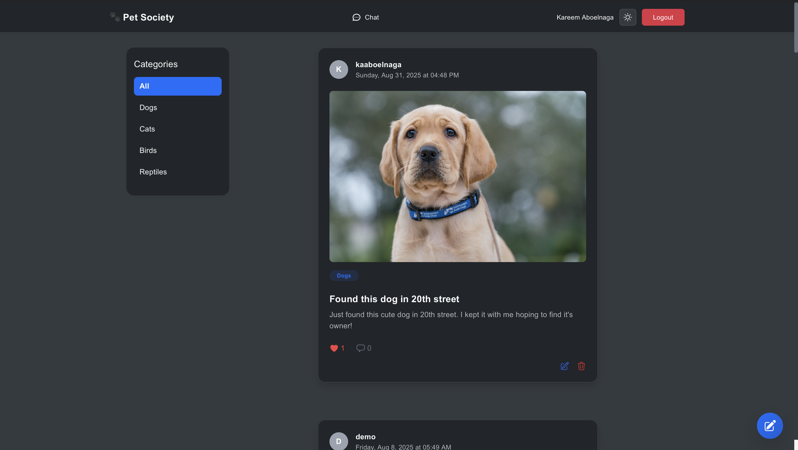

# Pet Society

A full-stack social platform for pet owners — share posts, follow other owners, comment, like, and message.

**Live demo:** https://pet-society-silk.vercel.app



---

## Features

- **Posts and feed** — create, edit and delete posts with images; a feed of posts from accounts you follow
- **Social graph** — follow and unfollow other users, with follower and following counts
- **Engagement** — likes and threaded comments on posts
- **Messaging** — direct conversations between users
- **Authentication** — registration, login, and per-user profile pages with avatars

## Tech stack

| Layer | Technology |
|---|---|
| Backend | Django, Django REST Framework <!-- VERIFY: remove DRF if the backend renders templates --> |
| Frontend | React, React Router |
| Database | PostgreSQL |
| Styling | Tailwind CSS |
| Deployment | Vercel (frontend) | Railway (backend)

## Project structure

```
.
├── backend/          # Django project: models, API, admin
└── frontend/         # React single-page app
```
<!-- VERIFY: adjust these folder names to match the repo. -->

## Running locally

**Requirements:** Python 3.10+, Node 18+, PostgreSQL 14+

### Backend

```bash
cd backend
python -m venv venv
source venv/bin/activate        # Windows: venv\Scripts\activate
pip install -r requirements.txt

cp .env.example .env            # then fill in the values below
python manage.py migrate
python manage.py createsuperuser
python manage.py runserver
```

The API runs on `http://localhost:8000`.

**Environment variables**

| Variable | Description |
|---|---|
| `SECRET_KEY` | Django secret key |
| `DEBUG` | `True` for local development |
| `ALLOWED_HOSTS` | Comma-separated hostnames |

<!-- VERIFY: match these to the actual names used in settings.py, and commit a .env.example
     file (with empty values) so anyone cloning the repo knows what to set. -->

### Frontend

```bash
cd frontend
npm install
npm run dev
```

The client runs on `http://localhost:5173` and expects the API at `http://localhost:8000`.

## About this project

Built as a team project during the ITI Full Stack Python track, across roughly 76 commits.

**My contribution:** <!-- VERIFY AND EDIT — be specific and accurate. For example:
"the React frontend, the posts and comments API, and the follow/unfollow social graph."
Name only what you actually wrote. A precise, modest contribution note is far more
credible in an interview than a vague claim over the whole project. -->

## License

MIT
